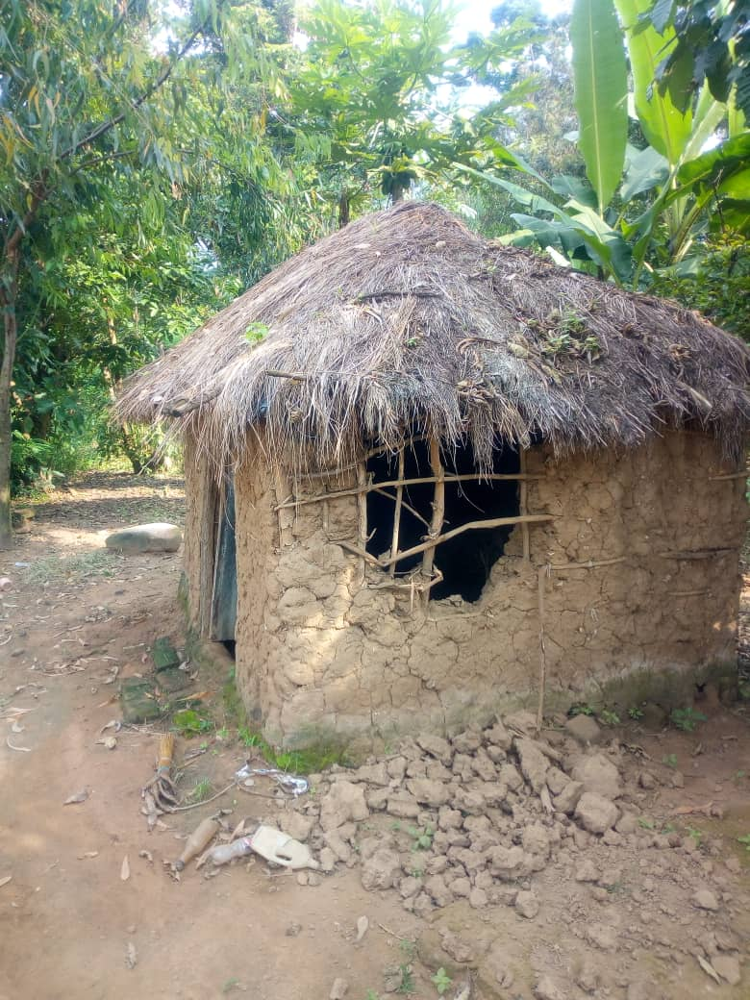
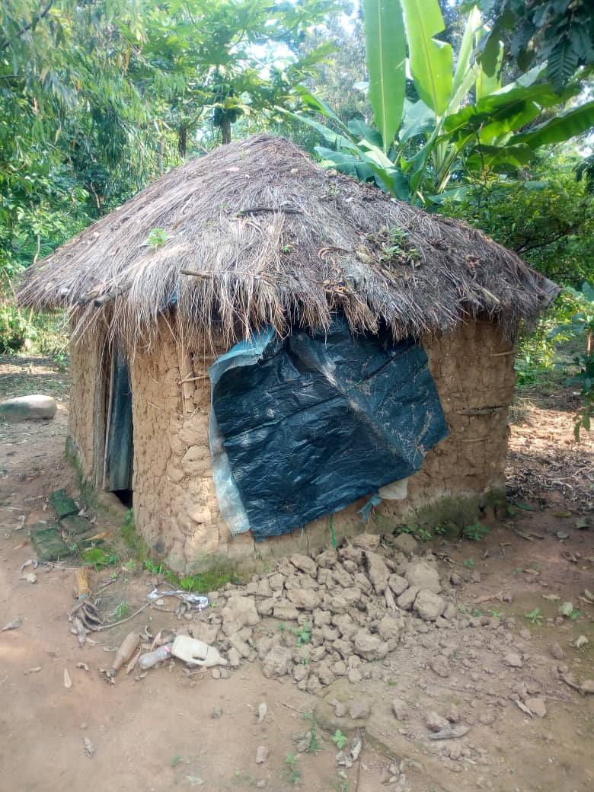
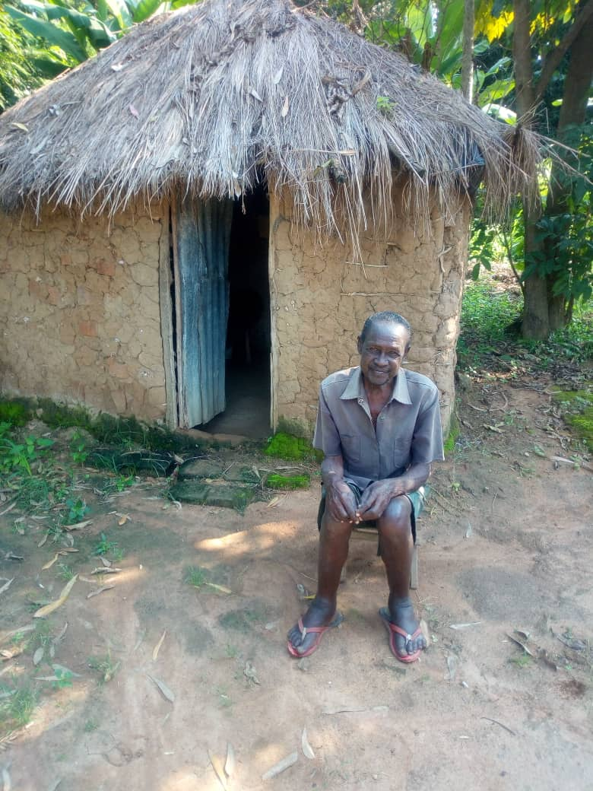
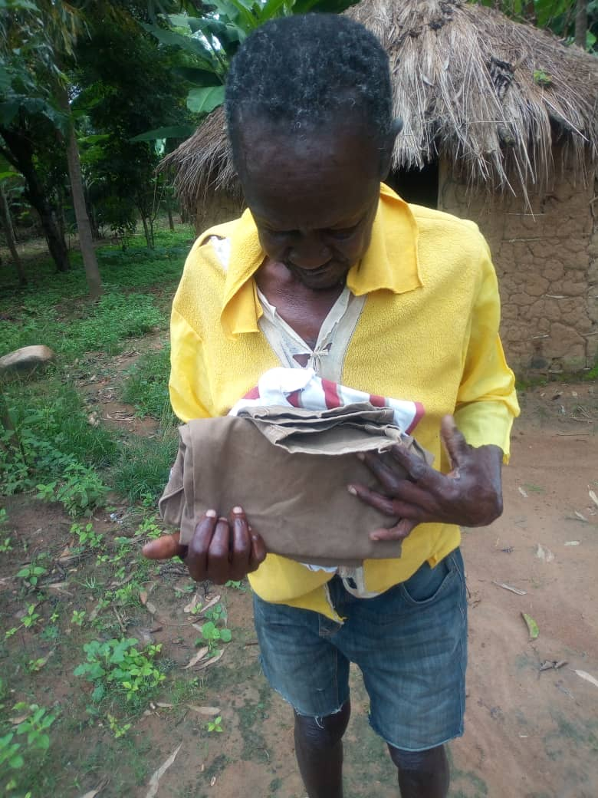
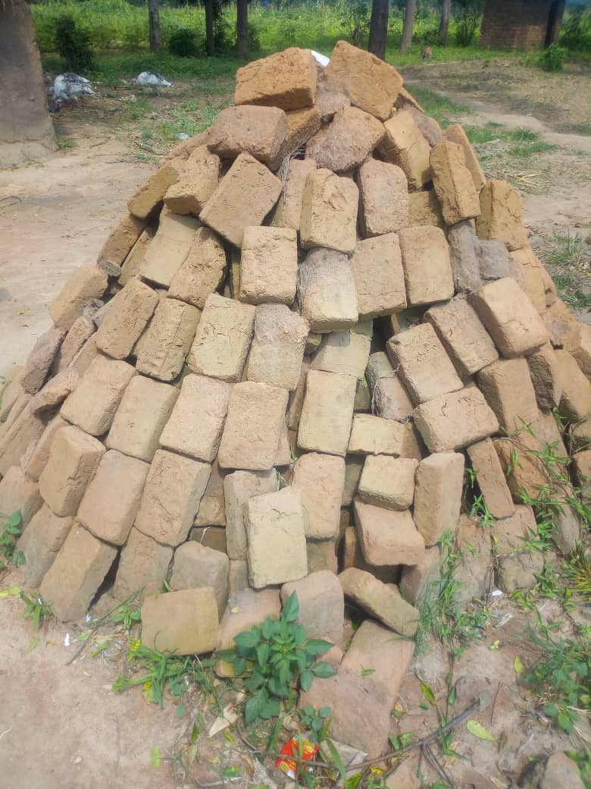

# Photo Gallery

Below are some photos of Arthur and the project. 

[ < Return to homepage](README.md) 

## 4 July 2020

<figure>

<figcaption>The damage to Arthur's current house</figcaption>
</figure>

 

<figure>

<figcaption>The damage to Arthur's current house</figcaption>
</figure>

## 17 June 2020

<figure>

<figcaption>Arthur outside his partially collapsed house</figcaption>
</figure>
 

<figure>

<figcaption>Some clothes bought for Arthur by his fellow villagers</figcaption>
</figure>
 
<figure>

<figcaption>Some bricks donated by a fellow villager. Not enough for a house, but a start.</figcaption>
</figure>
