# Sub-project 1 - A house for John

**Last update - 2020-11-09**

Below is a summary of the work carried out using the first 1750 GBP
of the donation money.

After meetings between David (our contact in the village) and 
the Knofacic workers, one family was identified who could
benefit most from the development work.

John (not his real name) is a 56-year-old AIDS patient living in the region of Peta.
Having been introduced to him by our contacts in the village, 
Knofacic learned that he is self skilled in tailoring, and strong enough to have his own
tailoring business if provided with a machine.

John is single after his wife left him 10 years ago. He has 2 boys (aged 18 & 14yrs)
and has 1 married girl aged 22 yrs.

<figure>
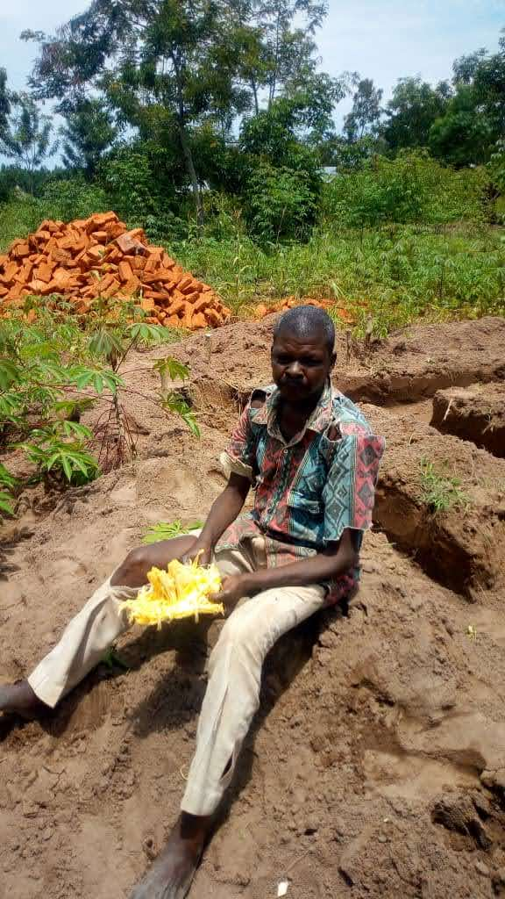
<figcaption>
John outside his original home, together with his 0.7 acres of land. They use the land to grow crops for food.
The house has no latrine of its own.
</figcaption>
</figure>

After discussions between the charity workers and David, the decision was made to build a new house for
John, and to purchase a sewing machine to help him get started in business.

## Initial funds transfer - 2020-10-10

The first 1000 GBP donated money was transferred by Knofacic staff to Uganda by bank transfer
with UK government gift-aid added on.

## Foundations begun - 2020-10-12

<figure>
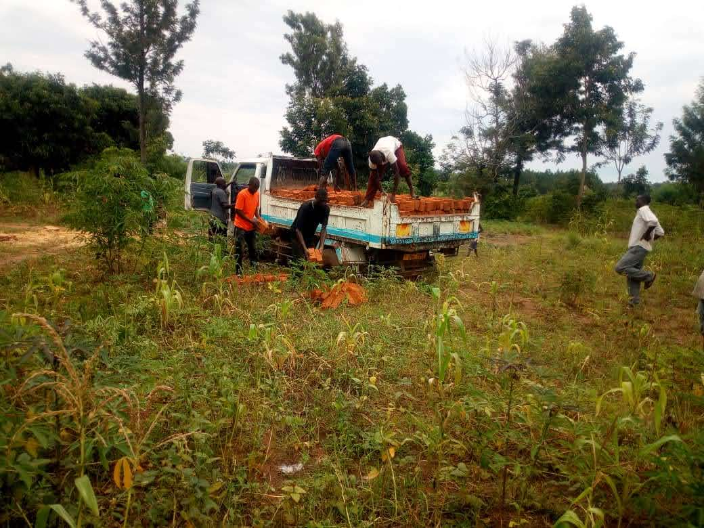
<figcaption>
Offloading bricks ready for construction of John's new house  (12 October 2020)
</figcaption>
</figure>

<figure>
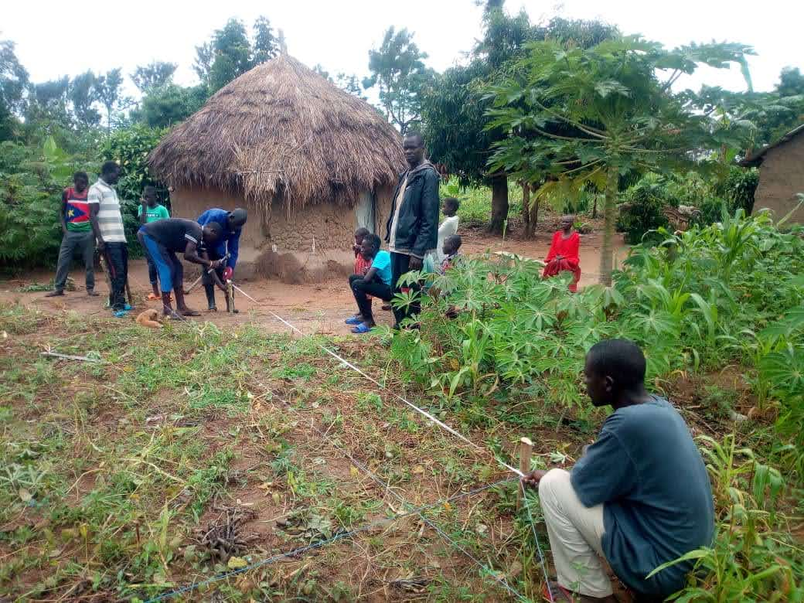
<figcaption>
Taking measurements for the foundations of the new house. The old house can be seen in 
the background  (12 October 2020)</figcaption>
</figure>

<figure>
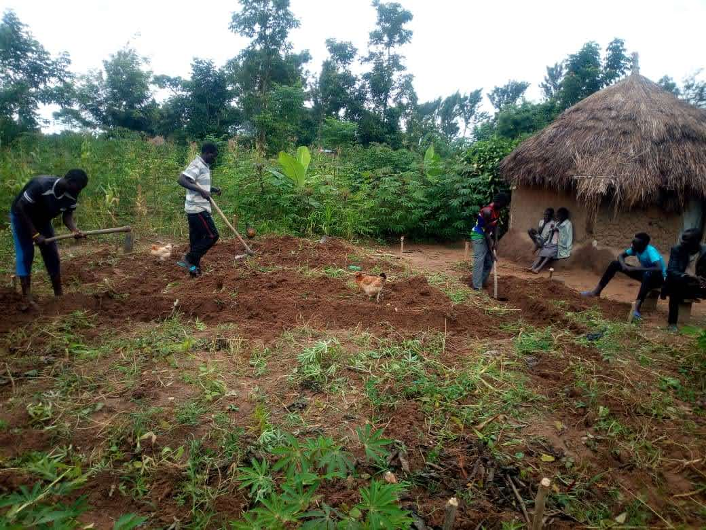
<figcaption>
Digging the foundations for the new house (12 October 2020)
</figcaption>
</figure>

 
<figure>
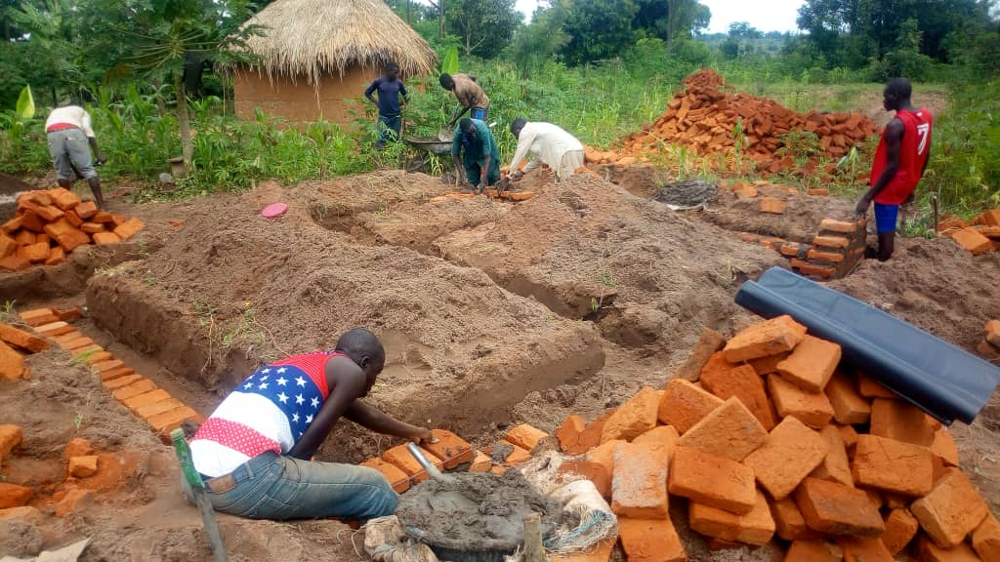
<figcaption>
Laying the foundations  (13 October 2020)
</figcaption>
</figure>

 ## Walls begun - 2020-10-14

<figure>
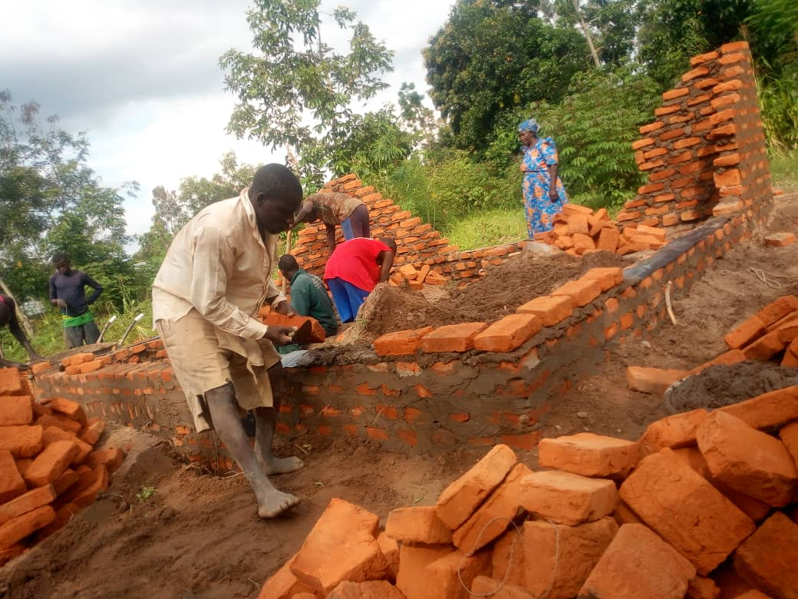
<figcaption>
Laying the first bricks (14 October 2020)
</figcaption>
</figure>

<figure>
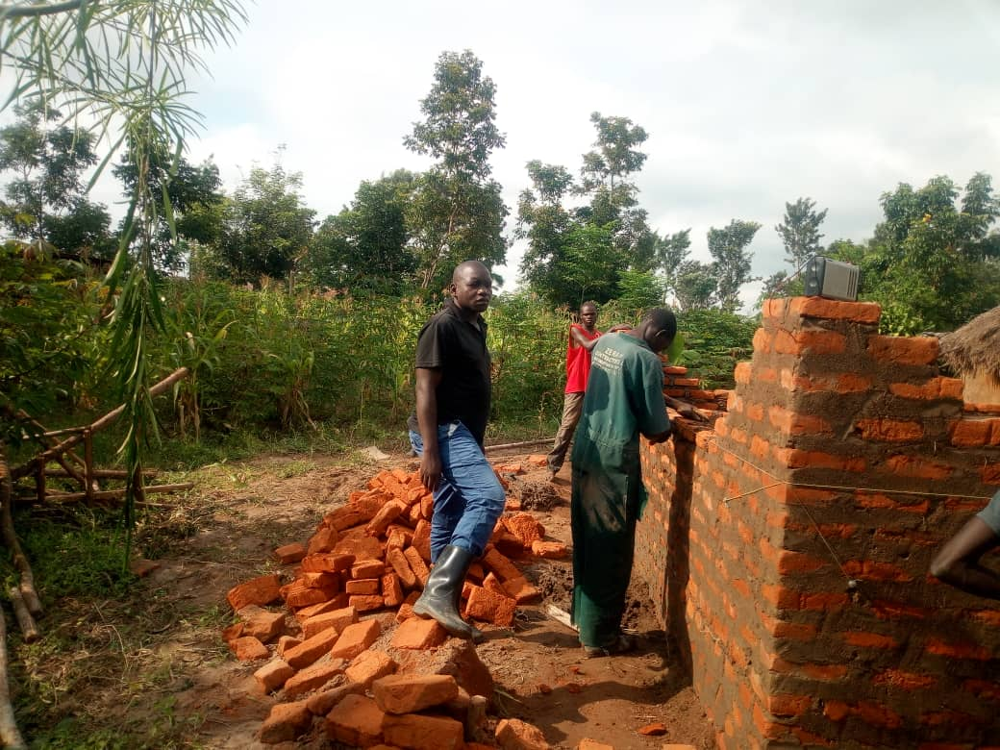
<figcaption>
Local construction workers raising the walls (14 October 2020)
</figcaption>
</figure>

## Rupert arrives - 2020-10-15

On hearing that his father was constructing a new house, John's son Rupert returned.

<figure>
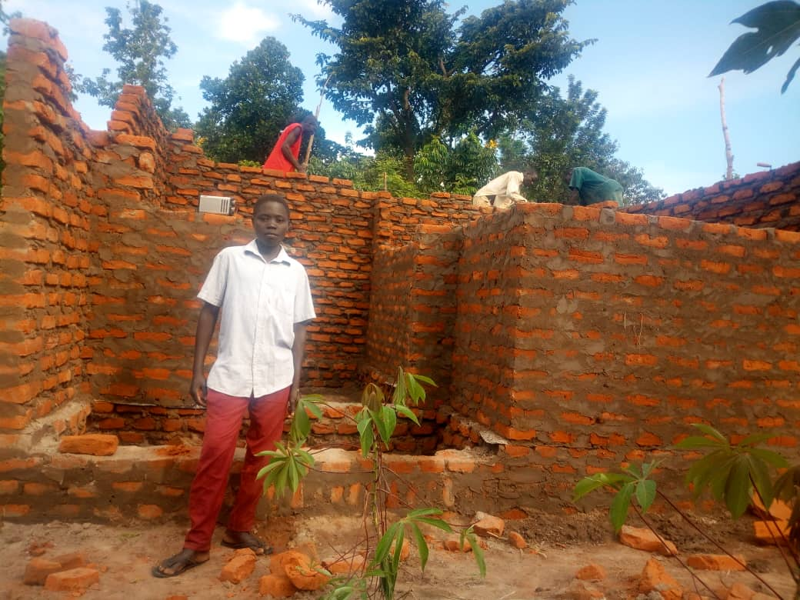
<figcaption>
John's son Rupert, in front of the half-constructed house (15 October 2020)
</figcaption>
</figure>

<figure>
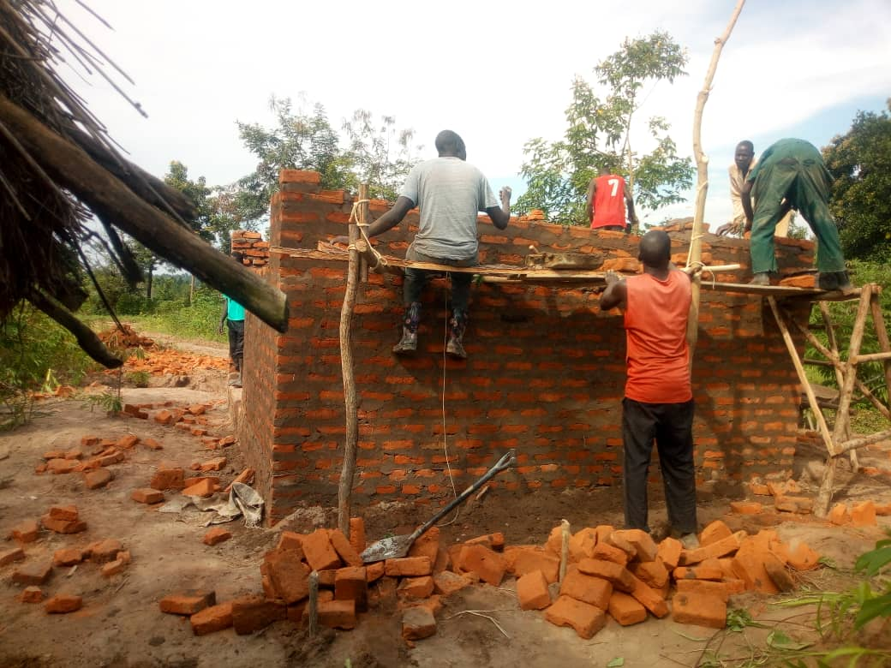
<figcaption>
Making the finishing additions to the walls (15 October 2020)
</figcaption>
</figure>

## Walls and roof completed - 2020-10-20

<figure>
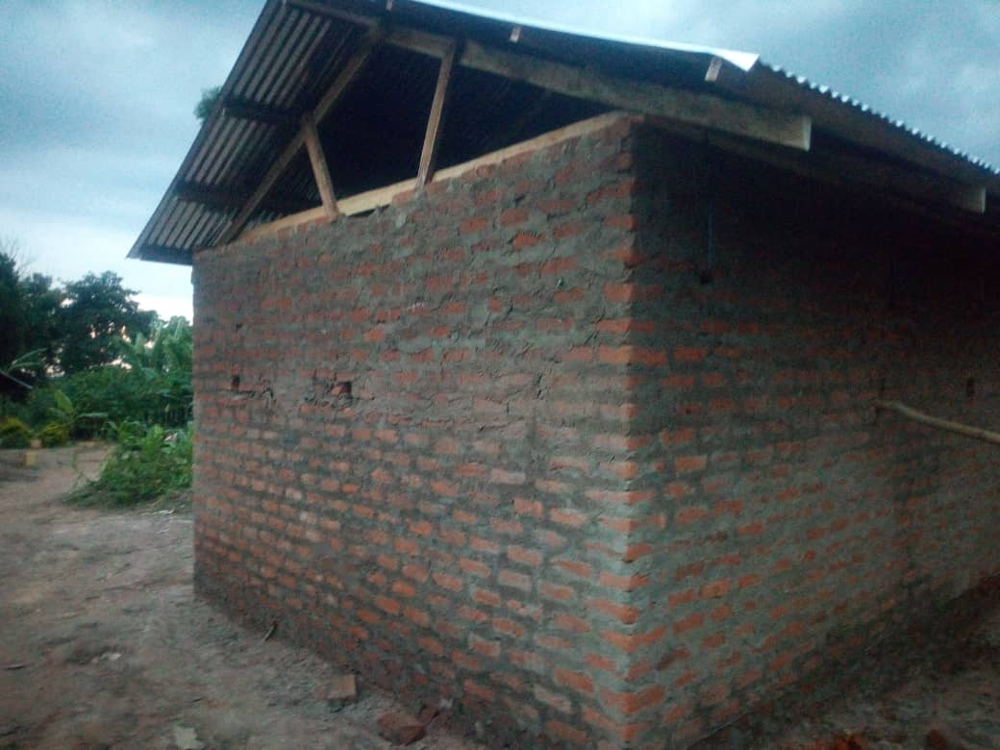
<figcaption>
Principle work completed on the walls and steel roof  (19 October 2020)
</figcaption>
</figure>

 

<figure>
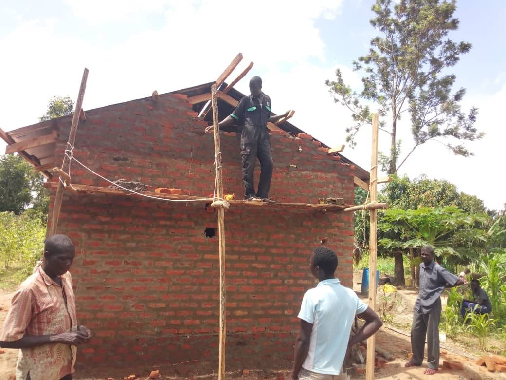
<figcaption>
Completing the gabel ends  (20 October 2020)
</figcaption>
</figure>

 
<figure>
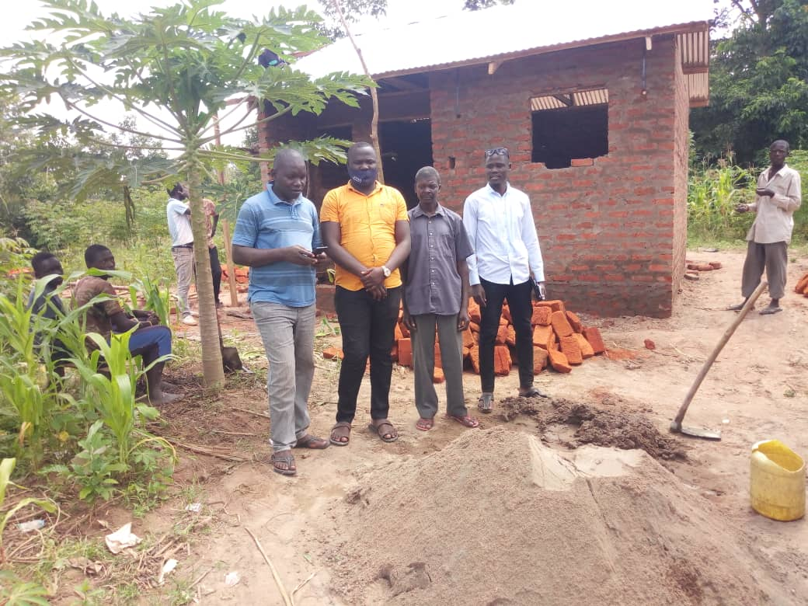
<figcaption>
Work almost complete. Knofacic charity workers plan the next steps (John is in the centre) (20 October 2020)
</figcaption>
</figure>

## Second funding transfer - 2020-10-20

A second installment of funding (this time 750 GBP) was sent on 2020-10-20, as the structure of the house was 
nearing completion. Painting has now commenced.  The next stage is to purchase bedding, etc.

More photos coming soon.

John will move into his new home as soon as it is safe and ready.

## Can I still donate?

Any additional money will be either be used for internal furnishings for John's house, or
to purchase items for others affected by AIDS in John's community in Peta.

To donate, visit the [GoFundMe page](https://www.gofundme.com/f/a-house-for-arthur-before-the-rains-come?utm_source=customer&utm_medium=copy_link&utm_campaign=p_cf+share-flow-1)  

Or you can make a donation directly to Knofacic using the Knofacic website. Then
contact me or them with your donation amount and name. 

